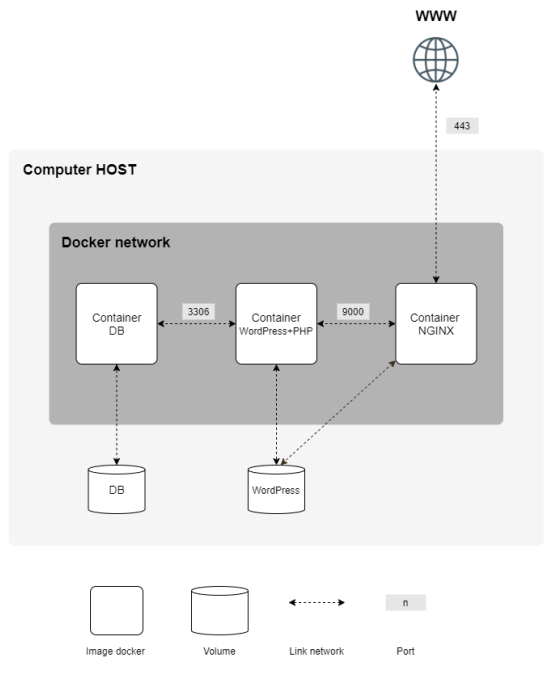

# Welcome to inception 🐋

This project is about using Docker and Docker compose to create a small multi-containers application with a wordpress website, running with php-fmp, nginx and mariadb.

We need to build the following architecture with a certain set of constraints :




## Table of contents
1. [Basics](#basics)
2. [Things that can help](#things-that-can-help)
3. [Security](#security)
4. [Bonus : Add more services to the application](#bonus-add-more-services-to-the-application)
5. [Installation](#installation)
6. [Resources](#resources)


## Basics

### Docker network : what kind of network should I chose ?

Docker documentation says :
>In terms of Docker, a **bridge network** uses a software bridge which allows containers connected to the same bridge network to communicate, while providing isolation from containers which are not connected to that bridge network. The Docker bridge driver automatically installs rules in the host machine so that containers on different bridge networks cannot communicate directly with each other.
>
>Bridge networks apply to containers running **on the same Docker daemon host**.

For this project, as it will run on a single Docker host and as I need different containers to communicate, I chose to use a **user-defined bridge network**.

Unlike default bridge network, which is automatically created by Docker when you start new containers, user-defined bridge networks comes with some benefits :
* **Automatic DNS resolution** between containers : you can directly reference a container to another using their names instead of --link flag
* **Better isolation** : the containers are not attached to a default network where they can communicate with other unrelated containers
* Containers on the same network share **environment variables**

### Depend-on : Control startup and shutdown order in Compose 

Docker-compose offers the possibility to condition thoffers the possibility of conditioning the start of a container to the status of another.

```yml
nginx:
    image: nginx:${TAG}
    build: ./requirements/nginx
    container_name: nginx
    depends_on:
      wordpress:
        condition: service_healthy
      adminer:
        condition: service_healthy
      hugo:
          condition: service_healthy
    restart: always
    ports: ['443:443']
    volumes: ['wordpress_data:/var/www/wordpress']
    networks: ['inception_network']
```

For example in this project, Nginx is forwarding php traffic to php-fpm services of wordpress and adminer, and proxying hugo server. In the configuration file of nginx, you have **references** to other containers :

```conf
...
location            ~* \.php$ 
    {
        fastcgi_split_path_info ^(.+\.php)(/.+)$;
        fastcgi_pass    wordpress:9000;
        fastcgi_index   index.php;
        include         fastcgi_params;
        fastcgi_param   SCRIPT_FILENAME $document_root$fastcgi_script_name;
        fastcgi_param   SCRIPT_NAME     $fastcgi_script_name;
    }
...
```

if you launch the nginx container before the wordpress container has finished installing and starting, you will generate **errors** in the nginx container. In addition, your web server will be accessible but some sites will return `502 bad gateway` errors.

### Healthcheck : Check that your container is ok

To help knowing the status of your container, you can tell docker to launch a certain command to check its status.

```yml
healthcheck:
      test: ["CMD", "mysqladmin", "ping", "--silent"]
      start_period: 20s
```

It is up to you to know which command will give you a status for your service. If the exit status of the command is equal to **0**, the docker considers your container `healthy`. It it is **1**, `not healthy`.

For some services, you can find healthcheck command online. Below is a **usefull command to check if the port you chose for your service is listening** :

```sh
netstat -an | grep <your port> /dev/null; if [ 0 != $$? ]; then exit 1; fi;
```

## Things that can help

### Launch a shell on a running container

```sh
docker exec -ti <container_name> sh
```

### Access container's log

You should redirect the logs of the services hosted in your container to stdout / stderr. Usually it is possible in the configuration files of the services, for example for nginx :

```conf
...
http {
    access_log  /dev/stdout;
    error_log   /dev/stderr;
...
```

This allows you to use the `docker logs <container>` command :

```sh
docker logs <container_name>
```
to see the logs in real time :
```sh
docker logs <container_name> --follow
```

## Security

### USER instruction in Dockerfile

```Dockerfile
USER    	www-data

ENTRYPOINT 	["docker-entrypoint.sh"]
```

The **USER** instruction allows you to execute the remaining commands of the dockerfile with a certain user.

I used it especially to **run the instructions at runtime with a non root user**, at the end of the Dockerfile. This is nice on multiple level :
* If you have folders that are binded between the host machine and a container, **every file a root user will create in it will be difficult to manage on the host if you are not root**.
* As a root, you can do a lot of things without restrictions on your container. This is convenient, but a **malicious user can use your container to get a root access on the host**.
* Finaly, using a non root user in your Dockerfile will **force you to understand and to manage properly the files and locations your application needs to access**. It is better if you are in a learning process.

### PORTS : binding host with containers in Docker-compose

```yml
 ftp:
    image: ftp:${TAG}
    build: ./bonus/ftp
    container_name: ftp
    restart: always
    /!\ ports: ['2222:2222']
    volumes: ['wordpress_data:/var/www/wordpress']
    networks: ['inception_network']
```

Docker-compose allows you to **bind a port of your host machine with a port of a container**.

It may seem like a good idea to bind the ports of your containers with the ports of your host, to have **easy access to them from the host**, for testing or monitoring the services.

**BUT** in the context of a **multi-containers application**, we have to think carefully about what should be the entrypoint(s) of the application, and only expose these. In our case, we only want to **bind port 443 of the host with the port 443 of Nginx container**.

### Networks

Containers on the same network can communicate.

If you need to secure a little bit more your multi-containers application, you can create **dedicated networks between certain containers instead of one big network for all containers**.

For example, in this project, I need my Nginx container to communicate with the wordpress/php-fpm container, but not with mariadb directly.

I could create multiple networks to allow communication between my containers :

```txt
network 1 : nginx / wordpress
network 2 : wordpress / mariadb
```

In the docker-compose.yml file, nginx will only be on `network 1`, mariadb on `network 2` and wordpress on `network 1` and `network 2`.

## Bonus add more services to the application

### Nginx parameterization

To have a better undestanding of nginx, I chose to use the Nginx container as the single entrypoint for all "web" services and to proxy other containers.

Understanding nginx http proxy :

[https://www.digitalocean.com/community/tutorials/understanding-nginx-http-proxying-load-balancing-buffering-and-caching](https://www.digitalocean.com/community/tutorials/understanding-nginx-http-proxying-load-balancing-buffering-and-caching)

Understanding nginx fastCGI proxy :

[https://www.digitalocean.com/community/tutorials/understanding-and-implementing-fastcgi-proxying-in-nginx](https://www.digitalocean.com/community/tutorials/understanding-and-implementing-fastcgi-proxying-in-nginx)


### Redis cache

Very good article from [@Catherine Macharia](https://www.section.io/engineering-education/authors/catherine-macharia/) explaining Wordpress and Redis cache : [How to Set Up and Configure Redis Caching for WordPress](https://www.section.io/engineering-education/how-to-set-up-and-configure-redis-caching-for-wordpress/)

Some interesting quotes from this article :

#### What is redis

>Redis is an open-source in-memory data structure store that can be used as a caching system. It is a memory caching software that runs as a service in the background. This allows you to cache and store data in memory for high-performance data retrieval and storage. 

#### How Redis cache works

>Assume you have a web application running on a server using a database like MySQL. That web application needs to retrieve some records from this database. Such queries take some time to return the requested records. And, if the query is expensive, a user waiting for that data for more than one minute may have a bad experience.
>
>However, Redis is made to make such processing faster and efficient. With it, it’s possible to store data processed by a MySQL database query inside of a Redis cache instance. This allows data to be retrieved directly from the server’s memory. This way, the application will not go all the way back to the database.
>
>Instead, the web server can check with Redis if it has the data it wants. So when another call is made and requires the same query transaction, instead of hitting the MySQL server again, the Redis object will serve the request from the object cache.

### FTP server

I chose to use [vsftpd](https://security.appspot.com/vsftpd.html) as it is easy to install and configure and it is very well documented online.

Nothing special about this one, you can spend some time of course with the parameterization of rights, access and authentication but I chose not to.

### Static website (using HUGO)

[HUGO](https://gohugo.io/) is very nice to use and work with. It is at the same time really small and presents a lot of good features, with the possibility to parameterize it with command line.

It also comes with its own web server to run it standalone in a container :)

### Adminer

Nothing special about this one. 

If you seek to build a dedicated container for it, you should build another php-fpm container to process the php of Adminer and adapt `nginx.conf` so you process the php  traffic properly between this container and the wordpress one.

### cAdvisor

A service that allow you to check your containers resource consoumption. I didn't zoom a lot on it.

It comes with its own server so I proxyied it with nginx. As it changes its URL it involve `rewrite` in nginx conf for a proper redirection.

## Installation

Be sure that you have Docker and Docker compose installed on you machine. Follow instructions on Docker website to [install Docker Engine](https://docs.docker.com/engine/install/). 

Clone the repository:
```sh
$> git clone git@github.com:twagger/inception.git
```
Make to build the complete application (build images and run them) :
```sh
$> make
```
To access the website, launch a browser and enter (you will have to bypass the security warning as the certificate is self-signed) :
```
https://twagner.42.fr
```

## Author

👨 **Thomas WAGNER**

* Github: [@twagger](https://github.com/twagger/)

## Resources
* [Best practices for building containers](https://cloud.google.com/architecture/best-practices-for-building-containers)
* [Top 20 Dockerfile best practices](https://sysdig.com/blog/dockerfile-best-practices/)
* [Docker ARG, ENV and .env - a Complete Guide](https://vsupalov.com/docker-arg-env-variable-guide/#arg-and-env-availability)
* [Docker and the PID 1 zombie reaping problem](https://blog.phusion.nl/2015/01/20/docker-and-the-pid-1-zombie-reaping-problem/)
* [Generate self-signed SSL Certificate](https://stackoverflow.com/questions/10175812/how-to-generate-a-self-signed-ssl-certificate-using-openssl)
* [Understanding and Implementing FastCGI Proxying in Nginx](https://www.digitalocean.com/community/tutorials/understanding-and-implementing-fastcgi-proxying-in-nginx)
* [Understanding Nginx HTTP Proxying, Load Balancing, Buffering, and Caching](https://www.digitalocean.com/community/tutorials/understanding-nginx-http-proxying-load-balancing-buffering-and-caching)
* [Permission problems in bind mount in Docker Volume](https://techflare.blog/permission-problems-in-bind-mount-in-docker-volume/)
